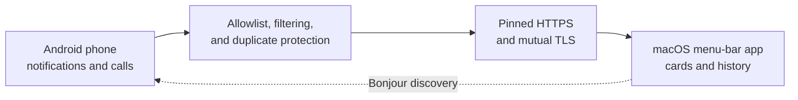

# PhoneBridge

PhoneBridge mirrors selected Android notifications and phone-call controls to a Mac over the local network. It is a direct, peer-to-peer bridge: notification content travels from the phone to the Mac without a cloud relay, account, or external backend.



## What it does

- Mirrors notifications only from apps selected on the Android phone.
- Shows lightweight notification cards and a recent history window on macOS.
- Mirrors notification icons and closes Mac cards when the notification is dismissed on the phone.
- Supports Answer, Reject, Silence, and End Call for calls from the phone's default dialer.
- Recovers from Mac address changes using verified Bonjour discovery and a bounded local-network scan.
- Shows live Mac reachability on the Android Home screen.
- Keeps notification traffic on the local Wi-Fi network or a private VPN.

## How pairing works

1. The Mac app creates a local HTTPS listener and displays a pairing QR code.
2. The Android app scans the QR and verifies the Mac's pinned TLS certificate before saving anything.
3. The phone enrolls its own Android Keystore certificate.
4. Future connections use mutual TLS plus a bearer token, with both devices authenticating each other.

The cached IP address is only a location hint. The certificate identities established during pairing remain the source of trust.

## Requirements

- macOS 14 or newer.
- Android 8.0/API 26 or newer.
- Both devices on the same local network or a mutually reachable private VPN.
- JDK 17 and Android SDK 35 for Android development.
- Xcode command-line tools with Swift 5.10 support for macOS development.

## Quick start

### 1. Build and run the Mac app

```bash
cd mac
./scripts/make-app.sh
open build/PhoneBridge.app
```

To copy it into `/Applications`:

```bash
cd mac
./scripts/make-app.sh install
```

### 2. Build and install the Android app

Enable USB debugging and connect the phone, then run:

```bash
cd android
./gradlew assembleDebug
adb install -r app/build/outputs/apk/debug/app-debug.apk
```

### 3. Pair the devices

1. Open the PhoneBridge menu-bar item on the Mac and choose **Pair a Phone…**.
2. Open PhoneBridge on Android and scan the QR code.
3. Grant Android notification access when prompted.
4. Open the **Apps** tab and select the apps whose notifications should be mirrored.
5. Optionally enable call mirroring and grant the requested phone and Do Not Disturb permissions.

## Privacy and security

- There is no cloud service in the notification data path.
- The phone pins the Mac's exact certificate from the QR code.
- The Mac pins the enrolled phone certificate after pairing.
- Android pairing secrets are stored in encrypted preferences; its private key stays non-exportable in Android Keystore.
- The Mac stores credentials and its encrypted 20-entry notification history in an owner-only application-support directory.
- Listener access is restricted to private/loopback source addresses and protected by connection, timeout, and payload limits.
- Unpairing on the Mac rotates the bearer token, deletes the enrolled phone certificate, and closes existing connections.

## Delivery model and limitations

- Delivery is best effort. If the Mac cannot be reached after one recovery attempt, that notification is dropped rather than queued.
- One Android phone can be enrolled at a time.
- The project is intended for local networks and private VPNs, not direct public-internet exposure.
- Ordinary notifications are display-only on the Mac; only supported phone calls have actions.
- Call controls apply only to the Android system's default dialer, not third-party VoIP apps.

## Project structure

```text
Phone-Notification/
├── android/                  Kotlin, Jetpack Compose, OkHttp, Android Keystore
├── mac/                      SwiftUI/AppKit, SwiftNIO, NIOSSL, CryptoKit
├── docs/Architecture/        Detailed architecture and lifecycle documentation
└── protocol.md               Versioned HTTPS/JSON protocol
```

## Tests

```bash
# Android unit tests and static analysis
cd android
./gradlew test lint

# macOS unit and integration tests
cd ../mac
swift test
```

## Documentation

- [Architecture guide](docs/Architecture/README.md)
- [Wire protocol](protocol.md)
- [Pairing and connection design](docs/Architecture/04-pairing-and-connection.md)
- [Notification lifecycle](docs/Architecture/05-notification-lifecycle.md)
- [Call-control lifecycle](docs/Architecture/06-call-control.md)
- [Security and data model](docs/Architecture/07-security-and-data.md)
