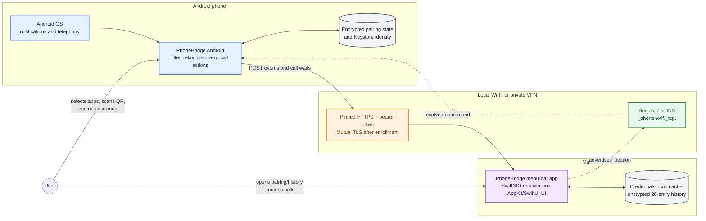
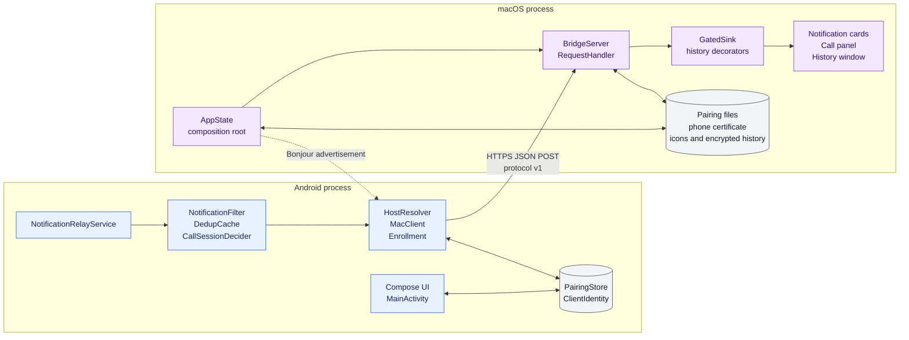

# System overview

PhoneBridge has two deployable applications and one versioned JSON/HTTPS contract. Android is the event producer and policy owner; macOS is the authenticated receiver, presenter, and short-history owner.

## System context

No notification content is routed through an external server. Network reachability, discovery, TLS, authentication, and delivery all occur directly between the two devices.

## Runtime container view

## Architectural responsibilities

| Concern | Android owner | macOS owner |
|---|---|---|
| User opt-in | Global mirror toggle, per-app allowlist, call toggle | Global receive/display gate |
| Event capture | `NotificationListenerService` and telephony APIs | None; the Mac receives explicit events |
| Destination trust | Pins the Mac server certificate from the QR | Pins the enrolled phone certificate in locked mode |
| Authentication | Presents client certificate and bearer token | Validates mTLS identity and bearer token |
| Location | Cached address, then verified mDNS/sweep recovery | Binds the listener and advertises Bonjour service |
| Delivery | Best-effort HTTPS POST; one recovery attempt | Validates and acknowledges each accepted request |
| Presentation | Recent-send diagnostics | Floating notification cards, call panel, history window |
| Retention | No notification-content queue or database | At most 20 encrypted history entries plus content-addressed icons |

## Core design rules

1. **Local and peer-to-peer.** The Mac listens on the private network; the phone connects directly.
2. **Explicit trust bootstrap.** A QR transfers the server fingerprint and bearer token. The phone verifies the endpoint before saving it, then enrolls its own client certificate.
3. **Event-driven normal operation.** A notification callback triggers filtering and, only when eligible, network work. Discovery is not left running.
4. **Best-effort notifications.** The current event is dropped when cached delivery and one rediscovery/retry path both fail.
5. **Silence by default at app level.** Only Android packages in the allowlist are mirrored. Calls require a separate toggle and only the default dialer is actionable.
6. **Defense in depth.** Private-source filtering, connection caps, TLS pinning, mTLS, bearer authentication, payload validation, and bounded storage are independent checks.
7. **Revocation severs sessions.** Listener reload and Mac-side unpair stop the listener and close already-accepted child connections before changing trust state.

## Protocol surface

All application endpoints are authenticated `POST` requests with JSON bodies.

| Endpoint | Direction | Purpose | Response behavior |
|---|---|---|---|
| `/notify` | Android → Mac | Deliver bounded notification metadata and an icon hash | Returns whether the Mac needs the icon bytes |
| `/icon` | Android → Mac | Upload a validated PNG addressed by SHA-256 | Acknowledges storage |
| `/dismiss` | Android → Mac | Close the card/call for a notification key and cancel a pending call wait | Idempotent success for unknown keys |
| `/call` | Android → Mac | Create/update a call card or confirm its active/silenced state | Acknowledges the UI event |
| `/call/wait` | Android → Mac | Long-poll for one call action | Held for at most 45 seconds, then returns an action or `none` |
| `/enroll` | Android → Mac | Register the Android client certificate during an open pairing window | Accepts in open mode; locked mode returns 403 |

See [protocol.md](../../protocol.md) for exact schemas, field bounds, and status codes.

## Technology choices

| Side | Runtime and UI | Networking and security | Persistence |
|---|---|---|---|
| Android | Kotlin, coroutines, Jetpack Compose, API 26+ | OkHttp, Android NSD, Java TLS, Android Keystore, ZXing QR scanner | `EncryptedSharedPreferences`; non-exportable EC key in Keystore |
| macOS | Swift 5.10, SwiftUI, AppKit, macOS 14+ | SwiftNIO, NIOHTTP1, NIOSSL, Bonjour, CryptoKit | Owner-only application-support directory; AES-GCM history |

## Deliberate non-goals

- Cloud relay, accounts, WAN traversal, or internet-facing discovery.
- Guaranteed delivery, offline queueing, replay, or cross-device synchronization.
- Multiple simultaneously enrolled phones.
- Acting on ordinary app notifications from the Mac.
- Moving phone-call audio to the Mac.

