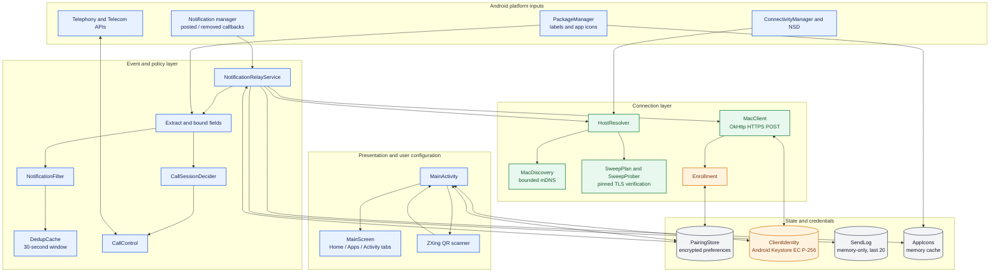
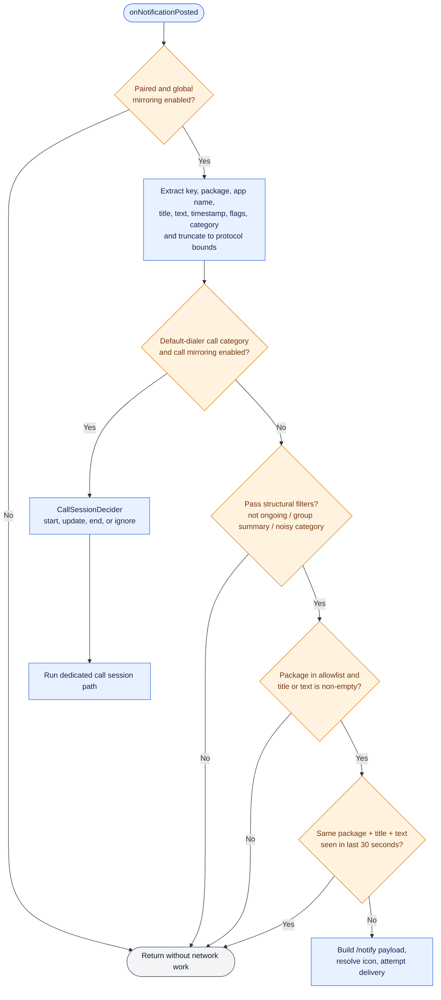

# Android architecture

The Android application separates user configuration from the background relay. `MainActivity` owns pairing and settings UX; `NotificationRelayService` owns notification/call events and performs network work on an I/O coroutine scope.

## Component flow

## Posted-notification decision flow

The call route is evaluated before the ordinary structural filter because dialer call notifications are normally ongoing and would otherwise be dropped. VoIP apps using the `call` category still follow the regular allowlist path; only the system default dialer receives telephony actions.

## Main classes and ownership

| Component | Responsibility | State/lifetime |
|---|---|---|
| [`MainActivity`](../../android/app/src/main/java/com/piyush/phonebridge/ui/MainActivity.kt) | QR scan, endpoint verification, replacement confirmation, enrollment, reachability status, unpair, permissions | Activity/UI lifetime |
| [`MainScreen`](../../android/app/src/main/java/com/piyush/phonebridge/ui/MainScreen.kt) and tabs | Home status, app allowlist, in-memory recent-send display | Compose state plus `PairingStore` |
| [`NotificationRelayService`](../../android/app/src/main/java/com/piyush/phonebridge/relay/NotificationRelayService.kt) | Orchestrates posted/removed events, notification delivery, call sessions, dismissal, and cached client lifecycle | Android notification-listener service; `SupervisorJob + Dispatchers.IO` |
| [`NotificationFilter`](../../android/app/src/main/java/com/piyush/phonebridge/filter/NotificationFilter.kt) | Structural, category, allowlist, and empty-content gates | Stateless |
| [`DedupCache`](../../android/app/src/main/java/com/piyush/phonebridge/filter/DedupCache.kt) | Suppresses identical package/title/text content for 30 seconds | Process memory |
| [`CallSessionDecider`](../../android/app/src/main/java/com/piyush/phonebridge/relay/CallSessionDecider.kt) | Distinguishes new calls, caller-name updates, phone-side answers, and ignored reposts | Pure decision logic |
| [`CallControl`](../../android/app/src/main/java/com/piyush/phonebridge/relay/CallControl.kt) | Guards and executes answer, reject, silence, end, and ringer restoration | Process memory plus Android telephony state |
| [`MacClient`](../../android/app/src/main/java/com/piyush/phonebridge/net/MacClient.kt) | Pinned-TLS OkHttp client, bearer header, endpoint methods, 3-second ordinary timeouts and 55-second call-wait timeout | Cached by all credentials that affect a TLS session |
| [`HostResolver`](../../android/app/src/main/java/com/piyush/phonebridge/net/HostResolver.kt) | Bounded mDNS, verified fallback sweep, cache update, and sweep cooldown | Created by UI/service; one shared failure timestamp |
| [`PairingStore`](../../android/app/src/main/java/com/piyush/phonebridge/pairing/PairingStore.kt) | Pairing credentials, host cache, toggles, allowlist, and enrolled identity fingerprint | Encrypted preferences |
| [`ClientIdentity`](../../android/app/src/main/java/com/piyush/phonebridge/net/ClientIdentity.kt) | Creates, health-checks, rotates, and exposes the non-exportable mTLS identity | Android Keystore plus process caches |

## Local state model

| State | Persistence | Content |
|---|---|---|
| Pairing and preferences | Encrypted | Bearer token, Mac certificate fingerprint, verified numeric host, port, allowlist, global/call toggles, enrolled client fingerprint |
| Client identity | Keystore | EC P-256 private key and self-signed certificate; private key is non-exportable |
| Recent sends | Memory only | At most 20 outcome entries for the Activity tab |
| Duplicate cache | Memory only | Notification content fingerprints within a 30-second window |
| Delivered keys | Memory only | Up to roughly 200 successfully delivered keys used to decide whether removal needs `/dismiss` |
| Active calls | Memory only | One effective call session, caller name, and whether it was answered from the Mac |
| App icon cache | Memory only | 128×128 PNG bytes and SHA-256 hash by package |

`PairingStore.clear()` intentionally keeps the allowlist and user toggles while removing endpoint credentials and enrollment state.

On first secure-store access, an older plaintext token, pin, host/port, allowlist, and mirror toggles are copied into encrypted preferences. The plaintext store is cleared only after the encrypted commit succeeds. Android backup is disabled for the application, and enrollment is always tied to the fingerprint of the currently usable Keystore identity.

## Concurrency and lifecycle

- Notification callbacks launch work into one service-owned `SupervisorJob` on `Dispatchers.IO`; a failed event does not cancel other event work.
- The Compose UI uses a separate main-thread coroutine scope and moves probing/enrollment work to `Dispatchers.IO`.
- Active calls use a concurrent map; compound session decisions synchronize around that map. Delivered/answered sets are synchronized collections.
- `MacClient` is reused only while the bearer token, Mac fingerprint, and client-certificate fingerprint all match. Identity change closes pooled connections and cancels live calls.
- Listener disconnect and APK replacement both request an Android notification-listener rebind so system backoff does not leave mirroring dormant.
- There is no Android notification database or durable delivery queue.

## Permissions and platform services

| Capability | Requirement |
|---|---|
| Observe notifications | User grants notification-listener access to the non-exported service |
| Pair by QR | Camera permission; camera is declared optional at install time |
| Reach the Mac | Internet/network-state permissions and an active network |
| Answer/reject/end calls | `ANSWER_PHONE_CALLS`; end/reject require Android 9+ |
| Detect call state | `READ_PHONE_STATE` |
| Silence/restore ringer | User grants notification-policy (Do Not Disturb) access |

Call permissions are requested only when the user enables call mirroring. Pairing is refused if a usable Keystore client identity cannot be created.
