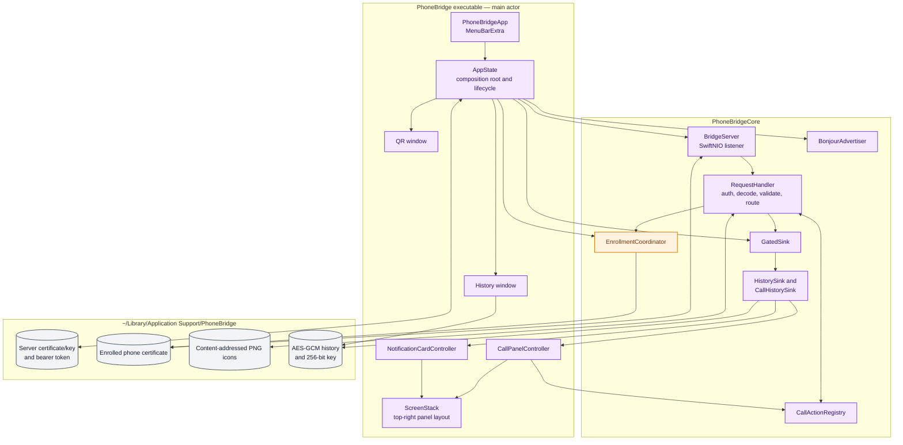
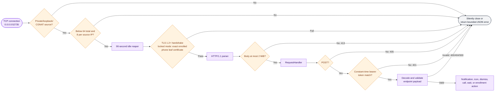
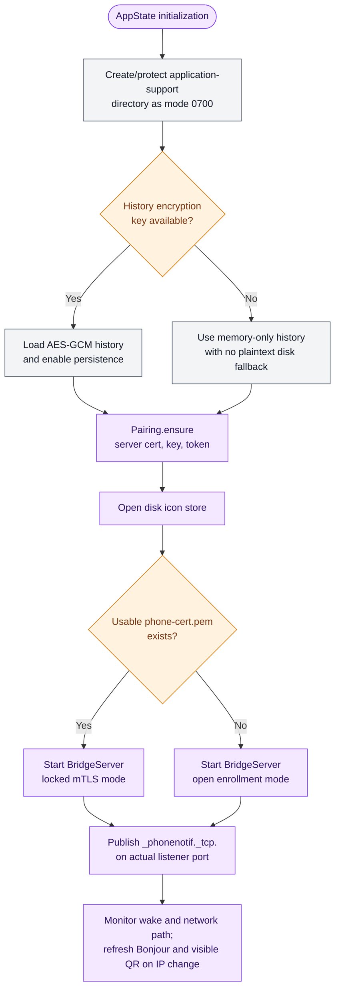
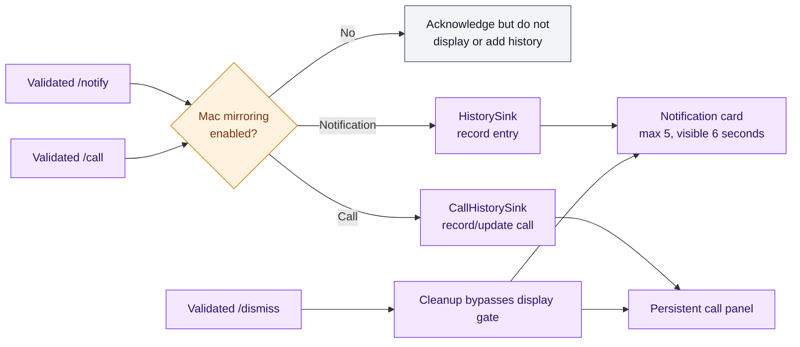

# macOS architecture

The Mac application is a SwiftUI menu-bar process with AppKit floating panels. `AppState` is the composition root: it creates credentials and stores, wires the server to UI sinks, controls open/locked TLS modes, publishes Bonjour, and reacts to wake/network changes.

## Component architecture

## Inbound server pipeline

Every accepted socket passes through the handlers in this order. Checks before TLS are intentionally cheap; application routing is reached only after transport trust succeeds.

The HTTP layer buffers a bounded body before bearer validation. The private-source gate, connection limits, idle timeout, and 2 MiB cap bound that exposure.

## Startup and lifecycle

## Sink and presentation flow

`RequestHandler` depends on protocols rather than concrete UI classes. `AppState` builds this decorator chain:

- Notification cards are custom non-activating `NSPanel` windows, not `UNUserNotificationCenter` banners. Clicking one closes it and opens history.
- Call cards have higher stack priority than ordinary cards and stay available for call actions.
- `ScreenStack` lays panels out at the top-right across Spaces without stealing keyboard focus.
- Dismiss/end cleanup always passes through even if mirroring was turned off after a card appeared.
- History dismissal is visual cleanup only; it does not delete the already-recorded history entry.

## Threading model

- `AppState` is `@MainActor`; SwiftUI/AppKit lifecycle and window changes stay on the main thread.
- `BridgeServer` uses one `MultiThreadedEventLoopGroup` thread. Its request handler may call thread-safe sinks from that event loop.
- Card and call-panel controllers dispatch presentation work to the main queue.
- `GatedSink`, `NotificationHistory`, `CallActionRegistry`, `EnrollmentCoordinator`, connection tracking, and connection limiting protect cross-thread mutable state with locks.
- `/call/wait` is the only asynchronous response path. All ordinary endpoints return synchronously after validation and dispatch.
- Production binds the fixed IPv4 listener `0.0.0.0:52735`. A brief three-attempt address-in-use retry handles a stale instance; there is no ephemeral-port fallback that would make the Android sweep contract lie.
- `AppState` can register the bundled application with `SMAppService` for start-at-login behavior; the menu-bar mirroring toggle is persisted in `UserDefaults` and immediately updates the thread-safe sink gate.

## Main source map

| Area | Implementation |
|---|---|
| Composition and server modes | [`AppState.swift`](../../mac/Sources/PhoneBridge/AppState.swift) |
| Menu-bar UI | [`PhoneBridgeApp.swift`](../../mac/Sources/PhoneBridge/PhoneBridgeApp.swift) |
| Network server and pre-TLS gates | [`BridgeServer.swift`](../../mac/Sources/PhoneBridgeCore/BridgeServer.swift) |
| Endpoint validation and routing | [`RequestHandler.swift`](../../mac/Sources/PhoneBridgeCore/RequestHandler.swift) |
| Server credentials and QR payload | [`Pairing.swift`](../../mac/Sources/PhoneBridgeCore/Pairing.swift) |
| Phone-certificate enrollment | [`PhoneEnrollment.swift`](../../mac/Sources/PhoneBridgeCore/PhoneEnrollment.swift) |
| Notification cards | [`NotificationCards.swift`](../../mac/Sources/PhoneBridge/NotificationCards.swift) |
| Call panel and actions | [`CallPanel.swift`](../../mac/Sources/PhoneBridge/CallPanel.swift), [`CallActionRegistry.swift`](../../mac/Sources/PhoneBridgeCore/CallActionRegistry.swift) |
| History and encryption | [`NotificationHistory.swift`](../../mac/Sources/PhoneBridgeCore/NotificationHistory.swift), [`HistoryCipher.swift`](../../mac/Sources/PhoneBridgeCore/HistoryCipher.swift) |
| Icon cache | [`IconStore.swift`](../../mac/Sources/PhoneBridgeCore/IconStore.swift) |
| Bonjour advertisement | [`BonjourAdvertiser.swift`](../../mac/Sources/PhoneBridgeCore/BonjourAdvertiser.swift) |
