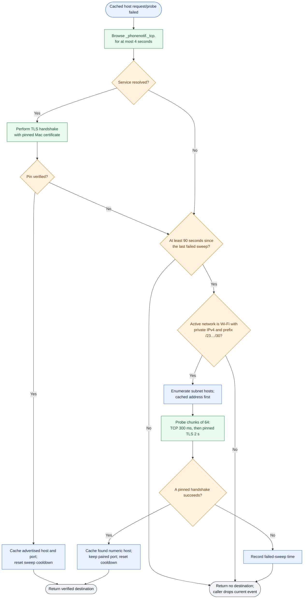
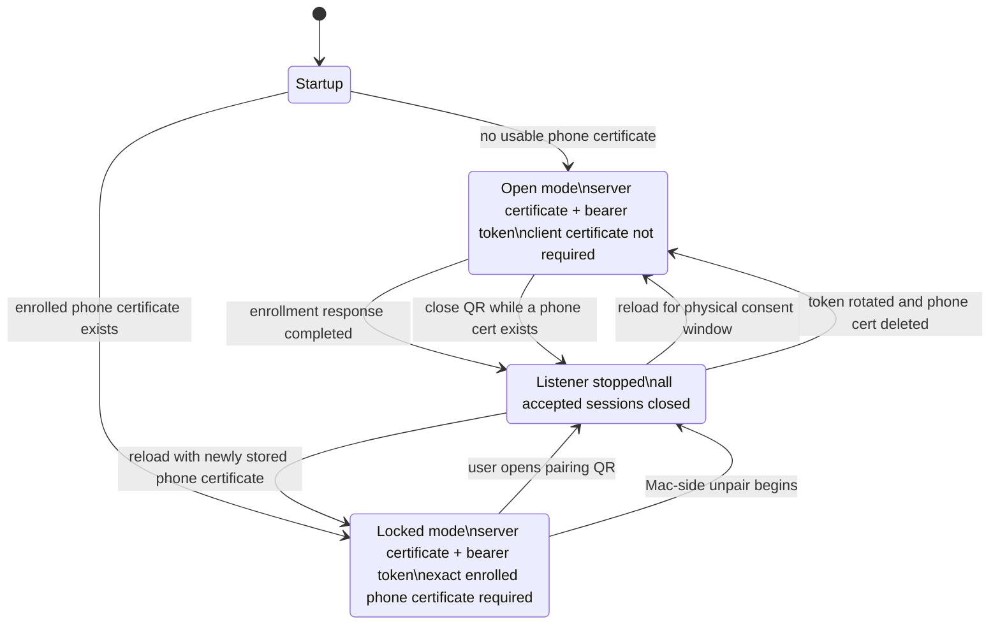
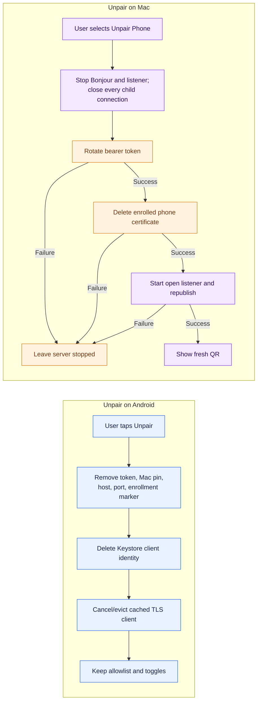

# Pairing and connection architecture

Pairing establishes two independent credentials and one location hint:

| Item | Generated/stored by | Purpose |
|---|---|---|
| Mac server certificate fingerprint | Mac generates certificate; QR transfers fingerprint; Android stores it | Android authenticates the exact Mac TLS leaf certificate |
| Random bearer token | Mac generates; QR transfers; both sides store it | Authenticates every HTTP request, including enrollment |
| Android client certificate | Android Keystore generates key/certificate; `/enroll` transfers public certificate; Mac stores it | Mac authenticates the phone during locked-mode mutual TLS |
| Host and port | Mac puts current address/port in QR and advertises Bonjour; Android caches only verified addresses | Locates the trusted Mac; location itself is not trusted |

The QR is a bootstrap message, not sufficient proof by itself. Android first proves that a local endpoint owns the advertised server certificate before it commits the pairing.

## Fresh pairing and mTLS enrollment

```mermaid
sequenceDiagram
    autonumber
    actor U as User
    participant MA as macOS AppState
    participant MS as Mac BridgeServer
    participant QR as Pairing QR
    participant AA as Android MainActivity
    participant KS as Android Keystore
    participant PS as Encrypted PairingStore

    U->>MA: Open Pair a Phone / Show Pairing QR
    MA->>MS: Reload listener in open mode
    Note over MA,MS: When a reload is needed, existing accepted connections are closed
    MA->>QR: Render v, private host, port, token, server fingerprint
    U->>AA: Scan QR
    AA->>AA: Parse version and field formats
    AA->>KS: Ensure healthy EC P-256 client identity
    KS-->>AA: Certificate + non-exportable private key
    AA->>AA: Require active Wi-Fi and resolve only allowed local addresses
    AA->>MS: TLS probe candidate using QR server-certificate pin
    MS-->>AA: Pinned handshake succeeds
    opt Different Mac fingerprint is already stored
        AA->>U: Confirm replacing the current Mac
        U-->>AA: Confirm
    end
    AA->>PS: Atomically save token, pin, verified numeric host, port; clear enrollment marker
    AA->>MS: POST /enroll with bearer token and client certificate DER
    MS->>MS: Validate token, mode, JSON, version, and certificate DER
    MS->>MS: Store phone-cert.pem as mode 0600
    MS-->>AA: 200 {}
    MS->>MA: Response write completed; enrollment callback
    MA->>MS: Stop and restart listener in locked mTLS mode
    MA->>MA: Close pairing window and republish Bonjour
    AA->>PS: Mark this exact client fingerprint enrolled
    Note over AA,MS: Later TLS requires both exact certificate pins plus the bearer token
```

Relocking occurs after the complete enrollment response has been written. The listener still relocks if that write fails, avoiding an indefinitely open server. Android also retries enrollment after a later successful send, so an interrupted initial enrollment is recoverable.

## Steady-state connection establishment

```mermaid
flowchart LR
    EVENT(["Eligible notification,<br/>dismissal, call event, or UI probe"])
    CREDS["Load token, Mac pin,<br/>and current Keystore identity"]
    CLIENT["Reuse/build MacClient keyed by<br/>token + Mac pin + client pin"]
    ADDRESS["Use cached verified host:port"]
    TCP["TCP connect"]
    SOURCE{"Mac private-source and<br/>connection-limit gates pass?"}
    TLS["TLS 1.2+ handshake"]
    SERVER_PIN{"Android: Mac leaf SHA-256<br/>equals QR pin?"}
    CLIENT_PIN{"Mac locked mode: phone leaf DER<br/>equals enrolled certificate and<br/>CertificateVerify succeeds?"}
    HTTP["POST JSON with<br/>Authorization: Bearer token"]
    AUTH{"Mac constant-time token<br/>check and payload validation pass?"}
    ACTION["Execute endpoint action<br/>and return bounded JSON"]
    RECOVER["Run bounded rediscovery<br/>and retry current event once"]
    FAIL(["Drop current event or<br/>show unreachable status"])

    EVENT --> CREDS --> CLIENT --> ADDRESS --> TCP --> SOURCE
    SOURCE -- "No" --> RECOVER
    SOURCE -- "Yes" --> TLS --> SERVER_PIN
    SERVER_PIN -- "No" --> RECOVER
    SERVER_PIN -- "Yes" --> CLIENT_PIN
    CLIENT_PIN -- "No" --> RECOVER
    CLIENT_PIN -- "Yes" --> HTTP --> AUTH
    AUTH -- "No" --> FAIL
    AUTH -- "Yes" --> ACTION
    RECOVER -- "Found verified Mac" --> HTTP
    RECOVER -- "Not found" --> FAIL

    classDef android fill:#e8f1ff,stroke:#2563eb,color:#172554;
    classDef mac fill:#f3e8ff,stroke:#7c3aed,color:#2e1065;
    classDef network fill:#e8f8ee,stroke:#15803d,color:#14532d;
    classDef security fill:#fff3e0,stroke:#d97706,color:#78350f;
    classDef terminal fill:#f3f4f6,stroke:#4b5563,color:#111827;
    class EVENT,CREDS,CLIENT android;
    class ADDRESS,TCP,TLS,HTTP,RECOVER network;
    class SOURCE,SERVER_PIN,CLIENT_PIN,AUTH security;
    class ACTION mac;
    class FAIL terminal;
```



Hostname verification is intentionally disabled on Android because identity is the exact pinned leaf fingerprint, not a CA/hostname chain. The TLS channel still provides encryption and proof that the endpoint owns the pinned certificate private key.

## Address recovery after a failed cached connection



Important properties:

- mDNS is a location hint and is verified before its host or port is cached.
- A subnet sweep is limited to private IPv4 Wi-Fi networks no wider than `/23`; broad/corporate networks are not swept.
- A TLS probe presents the Android client certificate, so discovery continues to work when the Mac is locked.
- Notification delivery retries the current event after a successful rediscovery. Nothing is queued for later.
- Foreground reachability checks use the same verified location logic. The Mac also republishes Bonjour and rerenders a visible QR when wake/network changes alter its primary IPv4 address.
- The production Mac listener is IPv4 on fixed port 52735. The port carried by a verified QR or Bonjour result is authoritative; the server does not silently move to an ephemeral port.

## Mac server-mode state machine



If there has never been an enrollment, closing the QR window cannot create a locked trust root, so the server remains open. A missing/corrupt phone certificate is likewise treated as no enrollment to permit recovery.

## Unpairing and revocation

Android-side and Mac-side unpair have different scopes:



Android unpair is local and does not send a revocation request to the Mac. Mac unpair is authoritative server-side revocation: the previous phone certificate and every copy of the old QR token stop working.

## Implementation map

- Android QR parsing and verification: [`QrPayload.kt`](../../android/app/src/main/java/com/piyush/phonebridge/pairing/QrPayload.kt), [`MainActivity.kt`](../../android/app/src/main/java/com/piyush/phonebridge/ui/MainActivity.kt), [`LocalAddressPolicy.kt`](../../android/app/src/main/java/com/piyush/phonebridge/net/LocalAddressPolicy.kt)
- Android discovery and probing: [`HostResolver.kt`](../../android/app/src/main/java/com/piyush/phonebridge/net/HostResolver.kt), [`MacDiscovery.kt`](../../android/app/src/main/java/com/piyush/phonebridge/net/MacDiscovery.kt), [`SweepPlan.kt`](../../android/app/src/main/java/com/piyush/phonebridge/net/SweepPlan.kt), [`SweepProber.kt`](../../android/app/src/main/java/com/piyush/phonebridge/net/SweepProber.kt)
- Android TLS identity and enrollment: [`PinnedTls.kt`](../../android/app/src/main/java/com/piyush/phonebridge/net/PinnedTls.kt), [`ClientIdentity.kt`](../../android/app/src/main/java/com/piyush/phonebridge/net/ClientIdentity.kt), [`Enrollment.kt`](../../android/app/src/main/java/com/piyush/phonebridge/net/Enrollment.kt)
- Mac pairing, enrollment, and modes: [`Pairing.swift`](../../mac/Sources/PhoneBridgeCore/Pairing.swift), [`PhoneEnrollment.swift`](../../mac/Sources/PhoneBridgeCore/PhoneEnrollment.swift), [`AppState.swift`](../../mac/Sources/PhoneBridge/AppState.swift)
