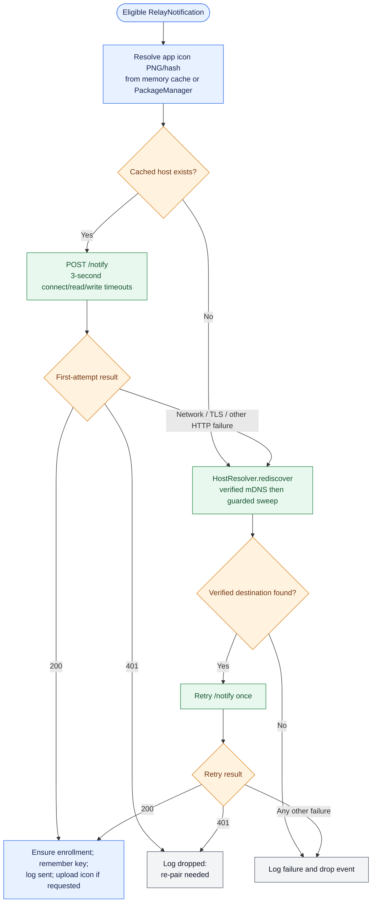
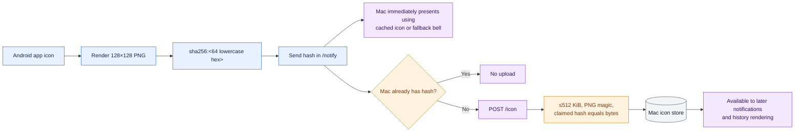
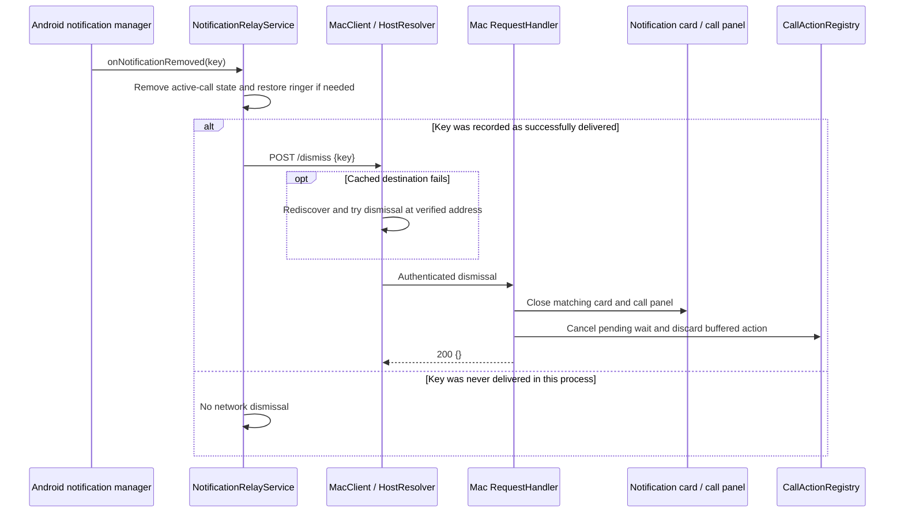

# Notification lifecycle

Normal notification mirroring is a bounded, best-effort transaction. Android filters before networking, tries the verified cached address, performs one on-demand recovery path when necessary, and does not retain a failed notification for later replay.

## End-to-end delivery sequence

```mermaid
sequenceDiagram
    autonumber
    participant OS as Android notification manager
    participant RS as NotificationRelayService
    participant PF as Filter + DedupCache
    participant IC as AppIcons
    participant MC as MacClient / HostResolver
    participant BS as Mac BridgeServer
    participant RH as RequestHandler
    participant GS as Gated + History sinks
    participant UI as macOS floating card

    OS->>RS: onNotificationPosted(StatusBarNotification)
    RS->>RS: Require paired + Android mirroring enabled
    RS->>RS: Extract and truncate protocol fields
    RS->>PF: Structural, allowlist, content, duplicate checks
    alt Event is not eligible
        PF-->>RS: Drop
    else Event is eligible
        PF-->>RS: Forward
        RS->>IC: Render/cache 128×128 app PNG and SHA-256
        RS->>MC: POST /notify to cached host with bearer + pinned/mTLS channel
        opt Cached request fails
            MC->>MC: Verified mDNS, then guarded subnet sweep
            MC->>BS: Retry /notify once at verified address
        end
        BS->>RH: Bounded HTTP request after transport gates
        RH->>RH: Authenticate; validate version, fields, icon hash, timestamp
        RH->>GS: show(payload, cached icon path if present)
        GS->>GS: If Mac mirroring is on, append encrypted history
        GS->>UI: Present custom card on main queue
        RH-->>MC: 200 {needIcon: true|false}
        opt Current client certificate is not marked enrolled
            MC->>BS: POST /enroll
            BS-->>MC: 200 accepted or 403 already locked
        end
        opt needIcon is true and Android has icon bytes
            MC->>BS: POST /icon with hash + base64 PNG
            BS->>RH: Verify size, PNG signature, and SHA-256
            RH-->>MC: 200 {}
        end
        RS->>RS: Remember delivered key; append in-memory send result
    end
```

The Mac dispatches card creation asynchronously, but the request is acknowledged after validation and sink invocation. A successful HTTP response means the event was accepted by the Mac process; it is not a durable-delivery guarantee.

## Android delivery decision and recovery



The retry loop is bounded: if the retried send also fails, its result is logged and the notification is dropped. It does not recursively rediscover.

## Filtering policy

The Android service forwards a normal notification only when all of these are true:

1. Pairing credentials exist and Android mirroring is enabled.
2. It is not an ongoing notification.
3. It is not a group summary.
4. Its category is not transport, progress, navigation, service, or system.
5. Its package is in the user-managed allowlist.
6. At least one of title or text is non-blank.
7. The same `package + title + text` has not been seen within 30 seconds.

The dedicated default-dialer call route is evaluated before these rules. See [Call control](06-call-control.md).

## Icon negotiation

Icons use content addressing to avoid uploading the same image with every notification:



For a previously unseen hash, the current card can use the fallback icon because `/notify` is displayed before `/icon` arrives. The upload warms the cache for later cards and history; the existing card is not retroactively refreshed.

## Dismissal sequence



Dismissal is idempotent. It removes live UI but deliberately leaves the corresponding history entry. Because delivered keys are process memory, a service/process restart can lose the knowledge needed to dismiss an older card; card safety timers provide a final UI bound.

## Receiver-side validation

| Check | Bound/action |
|---|---|
| HTTP method | Only `POST`; otherwise 405 |
| Authorization | Exact bearer token digest match; otherwise 401 |
| Body | At most 2 MiB at the HTTP layer; otherwise 413 |
| Protocol version | `v == 1` for `/notify`; otherwise 400 |
| Timestamp | No more than 24 hours old or 1 hour in the future |
| Strings | Key/package ≤256, app name ≤128, title ≤512, text ≤4096 characters |
| Icon hash | Empty or `sha256:` plus exactly 64 lowercase hexadecimal characters |
| Icon upload | ≤512 KiB, PNG signature, and matching SHA-256 |

Android truncates user-visible fields before sending so genuine oversized notifications arrive shortened instead of being rejected.

## Delivery semantics and failure behavior

| Situation | Behavior |
|---|---|
| Android global mirror off, not paired, filtered, not allowlisted, or duplicate | No network operation |
| Cached address stale | One on-demand discovery path, then retry current event |
| Mac asleep/offline or discovery fails | Drop current event and add an in-memory diagnostic entry |
| Bearer token rejected | Drop and show `re-pair needed` in recent sends |
| Mac certificate pin mismatch | TLS fails; no content is sent; failure is logged |
| Mac display gate off | Mac authenticates/validates and returns success but creates no card or history entry |
| Notification removed | Best-effort `/dismiss` only when this process remembers successful delivery |
| Android service destroyed | Coroutine work and live network calls are cancelled; no replay queue remains |

## Implementation map

- Android orchestration: [`NotificationRelayService.kt`](../../android/app/src/main/java/com/piyush/phonebridge/relay/NotificationRelayService.kt)
- Filtering and duplicate control: [`NotificationFilter.kt`](../../android/app/src/main/java/com/piyush/phonebridge/filter/NotificationFilter.kt), [`DedupCache.kt`](../../android/app/src/main/java/com/piyush/phonebridge/filter/DedupCache.kt)
- HTTP client and icons: [`MacClient.kt`](../../android/app/src/main/java/com/piyush/phonebridge/net/MacClient.kt), [`AppIcons.kt`](../../android/app/src/main/java/com/piyush/phonebridge/relay/AppIcons.kt)
- Mac routing, icon validation, and sinks: [`RequestHandler.swift`](../../mac/Sources/PhoneBridgeCore/RequestHandler.swift), [`IconStore.swift`](../../mac/Sources/PhoneBridgeCore/IconStore.swift), [`NotificationHistory.swift`](../../mac/Sources/PhoneBridgeCore/NotificationHistory.swift)
- Mac card UI: [`NotificationCards.swift`](../../mac/Sources/PhoneBridge/NotificationCards.swift)
