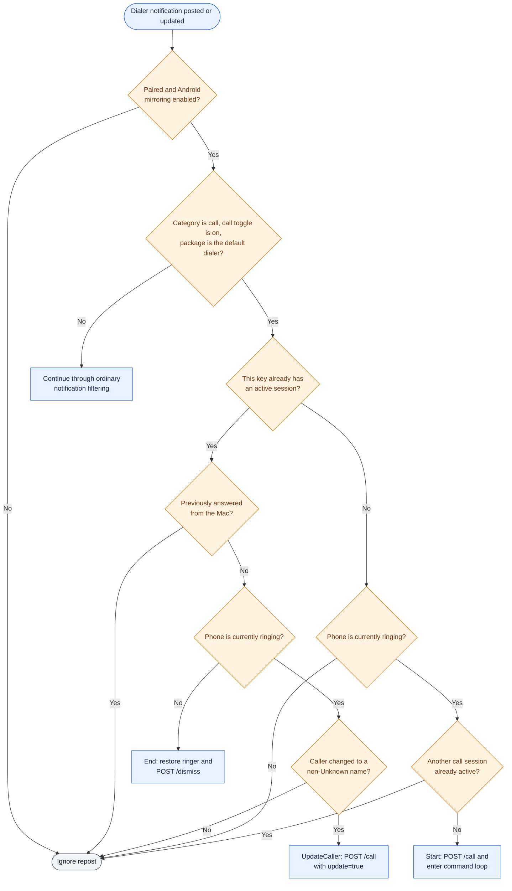
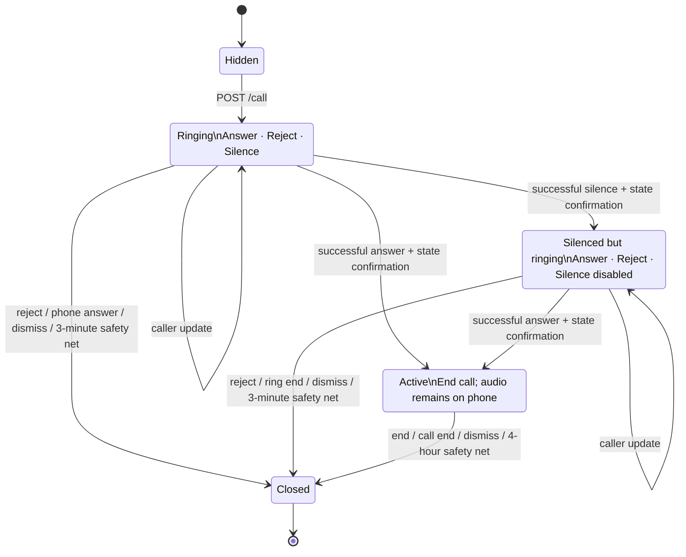

# Call-control architecture

Call mirroring is a specialized path for the Android system default dialer. It bypasses the normal ongoing-notification filter, creates a persistent Mac call card, and keeps a command channel alive through repeated 45-second long polls for the lifetime of the call session.

## Call eligibility and session decision



Only one effective call session is started at a time. A call-category notification from WhatsApp or another VoIP app does not receive telephony controls; it falls through to ordinary notification policy.

## Call session and action loop

```mermaid
sequenceDiagram
    autonumber
    participant D as Android default dialer
    participant RS as NotificationRelayService
    participant CC as CallControl
    participant MC as MacClient
    participant RH as Mac RequestHandler
    participant CP as CallPanelController
    participant AR as CallActionRegistry
    actor U as Mac user

    D->>RS: Incoming call notification
    RS->>CC: Confirm telephony state is RINGING
    RS->>MC: POST /call {key, caller, postedAt}
    MC->>RH: Authenticated call event
    RH->>CP: showCall(key, caller)
    CP-->>U: Persistent floating Answer / Reject / Silence card
    RH-->>MC: 200 {}

    loop While Android call session is alive
        RS->>MC: POST /call/wait {key}, read timeout 55 s
        MC->>RH: Long-poll request
        RH->>AR: Register completion for key
        alt User clicks while a wait is pending
            U->>CP: Click action
            CP->>AR: fulfill(key, action)
            AR-->>RH: Complete immediately
        else User clicks between two waits
            U->>CP: Click action
            CP->>AR: Buffer one action for key
            Note over AR,RH: Next registration consumes the buffered action
        else No action for 45 seconds
            AR-->>RH: none
        end
        RH-->>MC: 200 {action}
        MC-->>RS: answer / reject / silence / end / none
        RS->>CC: Re-check permissions and current call state; execute
        alt Answer succeeds
            RS->>MC: POST /call {state: active}
            MC->>RH: Confirm phone actually answered
            RH->>CP: Switch card to End call form
        else Silence succeeds
            RS->>MC: POST /call {state: silenced}
            MC->>RH: Confirm ringer actually changed
            RH->>CP: Mark Silence complete; keep card
        else Reject or End
            CP->>CP: Card closes immediately on click
            RS->>RS: Exit command loop
        else none
            RS->>RS: Begin the next wait
        end
    end

    D->>RS: Notification removed / call ended
    RS->>CC: Restore saved ringer mode if needed
    RS->>MC: POST /dismiss {key}
    MC->>RH: End session
    RH->>AR: Cancel wait and buffered action
    RH->>CP: Close call card
```

The Mac reports a changed state only after Android says the action succeeded. Permission denial, a race with call state, or a platform failure is recorded in Android recent sends and does not falsely update the card.

## Call-card state machine



Answering on the physical phone is intentionally different from answering through the Mac. A dialer repost with the same key while no longer ringing is interpreted as a phone-side answer and closes the Mac card. When the Mac initiated Answer, the session is marked so that equivalent repost is ignored and the End call control remains available.

## Action semantics

| Mac action | Android guard and API | On success | Session behavior |
|---|---|---|---|
| Answer | `ANSWER_PHONE_CALLS`, still ringing, `TelecomManager.acceptRingingCall()` | Send `state: active`; history becomes “Answered call” | Continue polling; card shows End call; audio stays on phone |
| Reject | Permission, still ringing, Android 9+, `TelecomManager.endCall()` | Call terminates | Exit loop; Mac closes card immediately |
| Silence | DND access, still ringing; save then set ringer mode silent | Send `state: silenced` | Continue polling; card remains, Silence disabled |
| End call | Permission, call not idle, Android 9+, `TelecomManager.endCall()` | Connected call terminates | Exit loop; Mac closes card immediately |
| `none` | No platform action | Nothing changes | Reissue `/call/wait` while session remains alive |

The saved ringer mode is restored when the ring/session ends. A 60-second delayed restoration is also scheduled after a successful Silence as a fallback.

Reject and End close the Mac card and exit the Android command loop even if the guarded phone action fails; the failure is retained in Android's recent-send diagnostics. The later dialer-removal callback still performs normal cleanup.

## Caller-name updates

The default dialer can post the same notification key first with a carrier-provided name and later with a contact name. While still ringing, a changed non-unknown caller becomes `/call` with `update: true`:

- the existing Mac panel text changes in place;
- the history entry is rewritten in place with the same ID and position;
- no new sound is played;
- the safety timer is not reset;
- “Unknown caller” never replaces a better known name.

## Timing and reliability bounds

| Bound | Value | Why |
|---|---:|---|
| One Mac long poll | 45 seconds | Prevents an indefinitely held application response |
| Android call-wait read timeout | 55 seconds | Leaves margin above the server hold |
| Server socket idle timeout | 90 seconds | Keeps valid long polls alive while reaping silent connections |
| Ringing-card safety net | 3 minutes | Final UI cleanup if phone dismissal is lost |
| Active-call safety net | 4 hours | Permits long calls while bounding a stale card |

`CallActionRegistry` keeps one pending completion per key and buffers one user action when no wait is registered. A new wait supersedes any older pending wait with `none`. `/dismiss` cancels both pending and buffered state, preventing a stale click from reaching a later session.

## Limitations

- Only the Android system default dialer is actionable.
- The architecture tracks one effective active call session.
- Call audio never moves to the Mac.
- Reject and End call are unavailable through supported APIs on Android 8/8.1, although the app itself supports API 26+.
- If the `/call` start cannot reach the Mac, no command loop is opened and the phone rings normally.
- A call-wait network failure ends the current command loop; the normal notification removal path still attempts dismissal later.

## Implementation map

- Android session orchestration: [`NotificationRelayService.kt`](../../android/app/src/main/java/com/piyush/phonebridge/relay/NotificationRelayService.kt)
- Android decision table and platform actions: [`CallSessionDecider.kt`](../../android/app/src/main/java/com/piyush/phonebridge/relay/CallSessionDecider.kt), [`CallControl.kt`](../../android/app/src/main/java/com/piyush/phonebridge/relay/CallControl.kt)
- Mac call endpoint and long-poll registry: [`RequestHandler.swift`](../../mac/Sources/PhoneBridgeCore/RequestHandler.swift), [`CallActionRegistry.swift`](../../mac/Sources/PhoneBridgeCore/CallActionRegistry.swift)
- Mac call UI and history decorator: [`CallPanel.swift`](../../mac/Sources/PhoneBridge/CallPanel.swift), [`NotificationHistory.swift`](../../mac/Sources/PhoneBridgeCore/NotificationHistory.swift)
