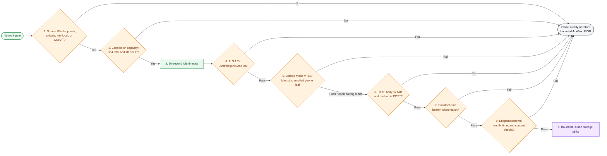
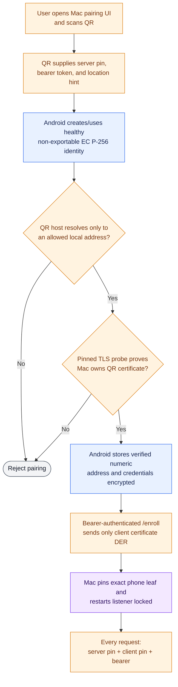
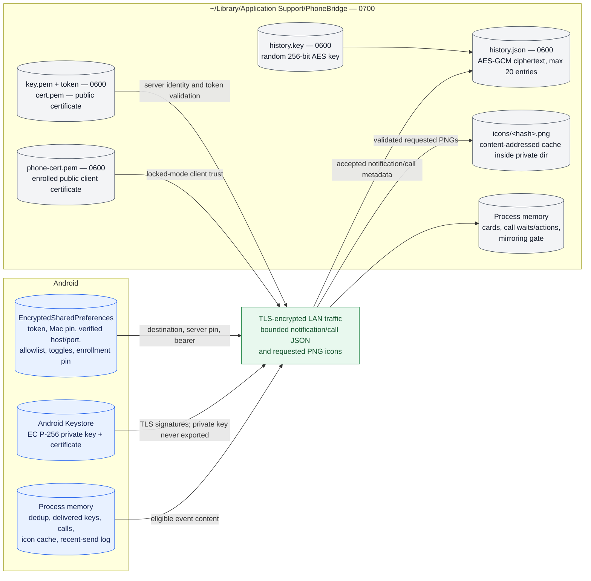

# Security and data architecture

PhoneBridge handles sensitive notification previews and call metadata. Its security model assumes the QR is exchanged with physical user intent, the devices communicate over a local/private network, and neither device's logged-in account is already compromised.

## Layered request defenses

These layers address different failures. The token remains required even after mTLS; a valid client certificate alone is not enough. Conversely, in locked mode a leaked token alone cannot reach HTTP without the phone's private key.

## Trust bootstrap and steady-state trust

### Certificate roles

- The Mac uses a self-signed RSA server certificate. Android compares the SHA-256 of the presented leaf DER to the QR pin; hostname and public-CA validation are not part of the trust decision.
- Android uses a self-signed EC P-256 client certificate. The Mac byte-compares the presented leaf DER to `phone-cert.pem`; the TLS `CertificateVerify` proof demonstrates possession of the corresponding private key.
- The phone private key remains in Android Keystore. Client-identity health checks verify P-256 parameters and the raw ECDSA operation required by the TLS provider; an incompatible legacy key is replaced and must enroll again.
- Open mode does not request a client certificate. It exists for first enrollment or an explicitly opened pairing window; bearer authentication still protects every endpoint.

## Data placement and lifetime

### Retained data

| Data | Retention and deletion |
|---|---|
| Android pairing credentials | Persist encrypted until Android unpair or replacement pairing |
| Android client private key | Keystore lifetime; deleted on Android unpair or replaced only when health checks prove incompatibility |
| Android notification content | No durable store; only bounded process-memory diagnostics/caches |
| Mac bearer token and server key | Persist across launches; token rotates on Mac unpair |
| Enrolled phone certificate | One public certificate; deleted/replaced by Mac pairing lifecycle |
| Mac notification history | Newest 20 entries; clearable from history UI; AES-GCM encrypted when persisted |
| Mac icons | Content-addressed disk cache; referenced by notification history/cards |

If the history key cannot be created or loaded, the Mac keeps history in memory only. It does not write plaintext. If an existing history blob cannot be decrypted or decoded, it is deleted at startup rather than left as stale or possibly legacy plaintext data.

## Validation and resource bounds

| Boundary | Implemented control |
|---|---|
| Network origin | Mac accepts IPv4 loopback, RFC 1918, IPv4 link-local, and CGNAT; the address predicate allows only `::1` if an IPv6 peer is presented |
| Concurrency | 64 accepted connections globally, 8 per source IP |
| Slow clients | Close after 90 seconds with no read or write |
| Request body | 2 MiB maximum before endpoint routing |
| Methods and routing | POST only; unknown paths return 404 |
| Token | Bearer token compared through fixed-size SHA-256 digests and a full XOR fold |
| Notification freshness | Between 24 hours in the past and 1 hour in the future |
| Text fields | Protocol-specific character caps; Android truncates before sending |
| Icon | Strict hash shape; decoded PNG ≤512 KiB; PNG magic and SHA-256 verified |
| History | 20 newest entries |
| Visible notifications | At most 5 ordinary cards, normally 6 seconds each |
| Call waits | One pending wait and at most one buffered non-`none` action per call key |

## Discovery security

Bonjour/mDNS is unauthenticated. PhoneBridge never treats an mDNS response as identity:

1. Resolve the advertised host and port.
2. Complete a TLS handshake using the stored Mac certificate pin and Android client identity.
3. Cache the address only after the pinned handshake succeeds.

The QR hostname is handled similarly during pairing: Android requires active Wi-Fi, resolves only private/link-local/unique-local/CGNAT destinations, probes the candidates by pin, and stores the numeric address that actually passed. This prevents public-host redirection and later DNS rebinding of the cached pairing destination.

## Revocation and failure posture

- **Mac unpair fails closed.** It stops Bonjour/listening and severs existing sessions before rotating the token and deleting the enrolled certificate. If a step fails, the listener remains stopped.
- **Mode reload severs existing sessions.** A connection accepted under an old open/locked policy cannot survive by remaining pooled or keeping a long poll alive.
- **Android identity rotation invalidates clients.** Cached OkHttp calls and pooled TLS sessions are cancelled/evicted when the identity changes.
- **Locked-mode handshake rejects unknown phones before HTTP.** The exact enrolled leaf and its private-key proof are required.
- **Open mode is an explicit recovery/consent state.** During that window, the bearer token rather than mTLS is the phone-authentication layer.
- **Missing/corrupt enrolled-phone certificate reopens enrollment.** This is a deliberate recovery tradeoff: an actor able to alter the private application-support directory is already inside the logged-in user's local filesystem boundary.
- **Normal delivery favors availability over replay.** A failure drops current notification content rather than accumulating a sensitive queue.

## Threat/control summary

| Threat | Primary controls | Residual boundary |
|---|---|---|
| LAN peer impersonates the Mac | Exact server-certificate pin; QR endpoint proof before save | User must scan the intended QR on a trusted Mac display |
| LAN peer sends fake events | Locked-mode mTLS plus bearer token | Pairing window temporarily uses token-only client authentication |
| mDNS poisoning | Pin-verified discovery before cache update | Poisoning can delay discovery but cannot authenticate a false endpoint |
| Stolen QR photograph/token | mTLS blocks steady-state use; Mac unpair rotates token | While pairing is open, possession of a still-current token matters |
| Public port exposure | Private-source gate before TLS | Design is still intended for LAN/private VPN, not WAN publication |
| Oversized/malformed input | Connection/body/field/time/icon bounds | Bodies up to 2 MiB are buffered before token validation |
| Notification data at rest | Encrypted Android prefs; AES-GCM Mac history; owner-only Mac files | Icons are not separately encrypted but live under the 0700 private directory |
| Stale authenticated session after revocation | Child-channel tracking and forced close on stop/reload | In-flight best-effort operations can fail and are not replayed |

## Security-relevant implementation map

- Android encrypted state and identity: [`PairingStore.kt`](../../android/app/src/main/java/com/piyush/phonebridge/pairing/PairingStore.kt), [`ClientIdentity.kt`](../../android/app/src/main/java/com/piyush/phonebridge/net/ClientIdentity.kt)
- Android pinning and local-address rules: [`PinnedTls.kt`](../../android/app/src/main/java/com/piyush/phonebridge/net/PinnedTls.kt), [`LocalAddressPolicy.kt`](../../android/app/src/main/java/com/piyush/phonebridge/net/LocalAddressPolicy.kt)
- Mac pre-TLS gates and mTLS: [`BridgeServer.swift`](../../mac/Sources/PhoneBridgeCore/BridgeServer.swift), [`PrivateAddress.swift`](../../mac/Sources/PhoneBridgeCore/PrivateAddress.swift)
- Mac auth and payload validation: [`RequestHandler.swift`](../../mac/Sources/PhoneBridgeCore/RequestHandler.swift)
- Mac private files, history, and encryption: [`PrivateFile.swift`](../../mac/Sources/PhoneBridgeCore/PrivateFile.swift), [`HistoryCipher.swift`](../../mac/Sources/PhoneBridgeCore/HistoryCipher.swift), [`NotificationHistory.swift`](../../mac/Sources/PhoneBridgeCore/NotificationHistory.swift)
- Full contract and intentional tradeoffs: [protocol.md](../../protocol.md)
